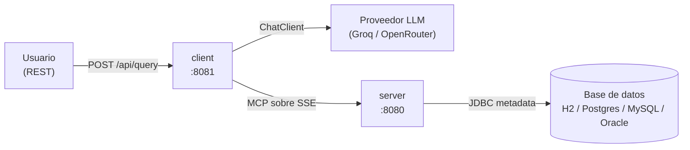

# Capsula MCP

Monorepo con dos aplicaciones **Spring Boot 4.1.1 (Java 21)** que implementan el
patrón **MCP (Model Context Protocol)** con **Spring AI 2.0.1**:

| App | groupId:artifactId | Rol |
|-----|--------------------|-----|
| [`server`](./server) | `com.capsula.mcp:server` | Servidor MCP que expone **metadata JDBC read-only** de una base relacional. |
| [`client`](./client) | `com.capsula.mcp:client` | Cliente MCP + LLM (**Groq / OpenRouter**, elegible por perfil) que traduce **lenguaje natural a SQL** usando las tools del server. |

---

## Arquitectura



El client es **agnóstico del proveedor**: habla con la abstracción `ChatClient` de Spring AI.
Los dos proveedores soportados son **OpenAI-compatible**, así que cambiar de uno a otro es
**solo configuración** (un perfil de Spring), sin tocar código.

1. El **client** recibe un pedido en lenguaje natural.
2. El LLM, guiado por un *system prompt*, **inspecciona el esquema real** llamando a las
   tools MCP del **server** (schemas, tablas, columnas, PKs, FKs, índices).
3. Con esa metadata, el LLM genera **una sentencia SQL** y el client la devuelve.

---

## Requisitos

- **Java 21**
- **Maven**
- Una **API key** de **al menos uno** de los proveedores soportados (ver abajo).

---

## Proveedor LLM: Groq u OpenRouter

El client puede usar **cualquiera de los dos proveedores** (todos OpenAI-compatible).
Cada uno tiene su **perfil de Spring** con su `base-url`, su variable de entorno para la
API key y su modelo. Elegís uno al levantar la app con `--spring.profiles.active=<perfil>`.

| Perfil | Proveedor | Modelo | Variable de entorno (API key) | Crear la key en |
|--------|-----------|--------|-------------------------------|-----------------|
| `groq` | Groq | `qwen/qwen3.8-27b` *(con razonamiento)* | `GROQ_API_KEY` | https://console.groq.com/keys |
| `openrouter` *(default)* | OpenRouter | `cohere/north-mini-code:free` *(sin razonamiento)* | `OPENROUTER_API_KEY` | https://openrouter.ai/keys |

> **Solo necesitás crear la key del proveedor que vayas a usar.** No hace falta tener las dos.
>
> El perfil por defecto es **`openrouter`** (definido en `application.properties`). Para usar
> otro proveedor, activá su perfil al arrancar (ver abajo).
>
> **Nota sobre razonamiento:** los modelos `qwen/qwen3.8-27b` (Groq) son *de razonamiento*
> y emiten un campo `reasoning_content` que rompe el tool-calling multi-turno. El client lo
> resuelve con un interceptor que lo elimina, activado por perfil (`capsula.model.strip-reasoning=true`).
> OpenRouter con el modelo por defecto no razona, así que el interceptor queda desactivado.

---

## Puesta en marcha

> El **client depende del server**: hay que levantar primero el server (puerto 8080)
> y luego el client (puerto 8081).

### 1. Configurar la API key del proveedor elegido

Definí **solo** la variable del proveedor que vayas a usar:

```powershell
# PowerShell (Windows) — elegí UNA
$env:OPENROUTER_API_KEY = "tu_api_key"   # perfil openrouter (default)
$env:GROQ_API_KEY       = "tu_api_key"   # perfil groq

```

```bash
# Bash (Linux/macOS) — elegí UNA
export OPENROUTER_API_KEY="tu_api_key"   # perfil openrouter (default)
export GROQ_API_KEY="tu_api_key"         # perfil groq

```

### 2. Levantar el server (puerto 8080)

```powershell
cd server
.\mvnw.cmd spring-boot:run
```

Arranca por default con **H2 en memoria** y un **esquema bancario** de demo
(schema `PRUEBA_MCP`) cargado automáticamente.

### 3. Levantar el client (puerto 8081)

```powershell
cd client

# Opción A: perfil por defecto (openrouter)
.\mvnw.cmd spring-boot:run

# Opción B: elegir el proveedor explícitamente
.\mvnw.cmd spring-boot:run "-Dspring-boot.run.profiles=groq"       # o openrouter
```

> También podés fijar el perfil con la variable de entorno
> `$env:SPRING_PROFILES_ACTIVE = "openrouter"` antes de arrancar.

### 4. Probar el endpoint

```powershell
curl -Method POST http://localhost:8081/api/query `
  -ContentType 'application/json' `
  -Body '{ "request": "clientes con al menos una tarjeta", "includeMetadata": false }'
```

Respuesta:

```json
{
  "sql": "SELECT c.ID, c.FIRST_NAME, c.LAST_NAME FROM PRUEBA_MCP.CUSTOMER c JOIN PRUEBA_MCP.BANK_ACCOUNT ba ON c.ID = ba.CUSTOMER_ID JOIN PRUEBA_MCP.CARD ca ON ba.ID = ca.BANK_ACCOUNT_ID GROUP BY c.ID, c.FIRST_NAME, c.LAST_NAME HAVING COUNT(ca.ID) >= 1"
}
```

Con `"includeMetadata": true` la respuesta incluye además la **traza de tools MCP**
que el LLM usó para construir la query.

---

## Estructura del repo

```
capsula-mcp/
├─ README.md             ← este archivo
├─ client/               ← app Spring Boot (pom + mvnw propios)
└─ server/               ← app Spring Boot (pom + mvnw propios)
```

Cada app es **autónoma**: tiene su propio `pom.xml` y su *Maven*.

---

## Base de datos (server)

El server es **agnóstico del motor**: cambiar de base = cambiar la dependencia JDBC
y activar el perfil correspondiente.

| Motor | Perfil | Notas |
|-------|--------|-------|
| **H2** | `h2` *(default)* | En memoria (`jdbc:h2:mem:mcpdb`), consola en `/h2-console`, demo auto-cargada. |
| PostgreSQL | `postgres` | — |
| MySQL | `mysql` | — |
| Oracle | `oracle` | — |

```powershell
# Ejemplo: arrancar el server con Postgres
$env:SPRING_PROFILES_ACTIVE = "postgres"; .\mvnw.cmd spring-boot:run
```

### Tools MCP expuestas por el server

| Tool | Descripción |
|------|-------------|
| `db_list_schemas` | Lista schemas (oculta los de sistema por default). |
| `db_list_tables` | Tablas/vistas de un schema. |
| `db_get_table_columns` | Columnas: tipo, nullability, default, size, scale, orden. |
| `db_get_foreign_keys` | FKs salientes (`imported`) o entrantes (`exported`). |
| `db_get_indexes` | Índices: nombre, unicidad, tipo, columnas. |
| `db_get_constraints` | PK + UNIQUE + FOREIGN_KEY. |

---

## Tests

```powershell
# Server
cd server; .\mvnw.cmd test

# Client
cd client; .\mvnw.cmd test
```

---

## Documentación adicional

- [`server/README.md`](./server/README.md) — detalle del servidor MCP (arquitectura, diagramas, tools, properties).
- [`client/README.md`](./client/README.md) — detalle del cliente NL→SQL.

---

## Configuración de puertos y endpoints

| App | Puerto | Endpoint principal |
|-----|--------|--------------------|
| server | `8080` | SSE MCP en `/sse`, mensajes en `/mcp/message`, consola H2 en `/h2-console` |
| client | `8081` | `POST /api/query`, Swagger UI en `/swagger-ui.html` |
