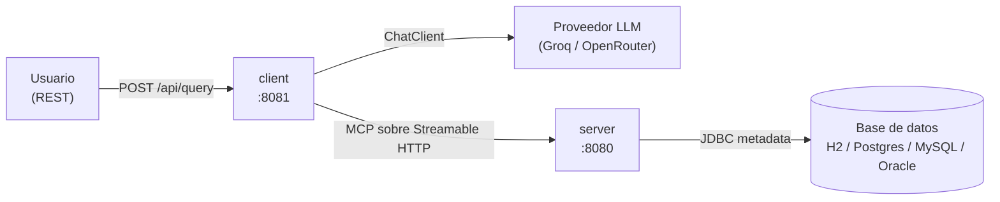

# Capsula MCP

Monorepo con dos aplicaciones **Spring Boot 4.1.1 (Java 21)** que implementan el
patrón **MCP (Model Context Protocol)** con **Spring AI 2.0.1**:

| App | groupId:artifactId | Rol                                                                                                                                                                                                                      |
|-----|--------------------|--------------------------------------------------------------------------------------------------------------------------------------------------------------------------------------------------------------------------|
| [`server`](./server) | `com.capsula.mcp:server` | Servidor MCP que expone **metadata JDBC read-only** de una base relacional.                                                                                                                                              |
| [`client`](./client) | `com.capsula.mcp:client` | Cliente MCP que traduce **lenguaje natural a SQL** usando un LLM (**Groq / OpenRouter**, elegible por perfil) que, mediante **tools MCP**, inspecciona el esquema real de una base de datos antes de construir la query. |
---

## Arquitectura



El client es **agnóstico del proveedor**: habla con la abstracción `ChatClient` de Spring AI.
Los dos proveedores soportados son **OpenAI-compatible**, así que cambiar de uno a otro es
**solo configuración** (un perfil de Spring), sin tocar código.

1. El **client** recibe un pedido en lenguaje natural.
2. El LLM, guiado por un *system prompt*, **inspecciona el esquema real** llamando a las
   tools MCP del **server** (schemas, tablas, columnas, PKs, FKs, índices).
3. Con esa metadata, el LLM genera **una sentencia SQL** y el client la devuelve.

---

## Requisitos

- **Java 21**
- **Maven**
- Una **API key** de **al menos uno** de los proveedores soportados (ver abajo).

---

## Proveedor LLM: Groq u OpenRouter

El client puede usar **cualquiera de los dos proveedores** (todos OpenAI-compatible).
Cada uno tiene su **perfil de Spring** con su `base-url`, su variable de entorno para la
API key y su modelo. Elegís uno al levantar la app con `--spring.profiles.active=<perfil>`.

| Perfil | Proveedor | Modelo (default) | API key (env) | Modelo (env) | Crear la key en |
|--------|-----------|------------------|---------------|--------------|-----------------|
| `groq` | Groq | `qwen/qwen3.8-27b` *(con razonamiento)* | `GROQ_API_KEY` | `GROQ_MODEL` | https://console.groq.com/keys |
| `openrouter` *(default)* | OpenRouter | `cohere/north-mini-code:free` *(sin razonamiento)* | `OPENROUTER_API_KEY` | `OPENROUTER_MODEL` | https://openrouter.ai/keys |

> **Solo necesitás crear la key del proveedor que vayas a usar.** No hace falta tener las dos.
>
> El perfil por defecto es **`openrouter`** (definido en `application.properties`). Para usar
> otro proveedor, activá su perfil al arrancar (ver abajo).
>
> **Modelo configurable:** cada perfil usa el modelo de la columna *default*, pero podés
> cambiarlo sin editar nada seteando la variable de entorno correspondiente
> (`GROQ_MODEL` / `OPENROUTER_MODEL`).
>
> **Nota sobre razonamiento:** los modelos como `qwen/qwen3.8-27b` (Groq) son *de razonamiento*
> y emiten un campo `reasoning_content` que rompe el tool-calling multi-turno. El client lo
> resuelve con un interceptor **siempre activo** que lo elimina; para modelos sin razonamiento
> (como el model cohere/north-mini-code:free de OpenRouter) es un no-op y no afecta en nada.

---

## Puesta en marcha

> El **client depende del server**: hay que levantar primero el server (puerto 8080)
> y luego el client (puerto 8081).

### 1. Configurar la API key del proveedor elegido

Definí **solo** la variable del proveedor que vayas a usar:

```powershell
# PowerShell (Windows) — elegí UNA
$env:OPENROUTER_API_KEY = "tu_api_key"   # perfil openrouter (default)
$env:GROQ_API_KEY       = "tu_api_key"   # perfil groq

```

```bash
# Bash (Linux/macOS) — elegí UNA
export OPENROUTER_API_KEY="tu_api_key"   # perfil openrouter (default)
export GROQ_API_KEY="tu_api_key"         # perfil groq

```

### 2. Levantar el server (puerto 8080)

```powershell
cd server
.\mvnw.cmd spring-boot:run
```

Arranca por default con **H2 en memoria** y un **esquema bancario** de demo
(schema `PRUEBA_MCP`) cargado automáticamente.

### 3. Levantar el client (puerto 8081)

```powershell
cd client

# Opción A: perfil por defecto (openrouter)
.\mvnw.cmd spring-boot:run

# Opción B: elegir el proveedor explícitamente
.\mvnw.cmd spring-boot:run "-Dspring-boot.run.profiles=groq"       # o openrouter
```

> También podés fijar el perfil con la variable de entorno
> `$env:SPRING_PROFILES_ACTIVE = "openrouter"` antes de arrancar.

### 4. Probar la app

Con el server y el client levantados, tenés **dos formas** de probar el endpoint:

#### Opción A — Swagger UI (recomendada) 🧪

La forma más simple de probar la app sin herramientas externas. Abrí en el navegador:

**http://localhost:8081/swagger-ui.html**

Ahí vas a ver el endpoint `POST /api/query` documentado. Hacé clic en **"Try it out"**,
escribí tu pedido en lenguaje natural en el campo `request` y presioná **"Execute"**:
la respuesta con el SQL generado aparece directamente en la página.

#### Opción B — cURL

```powershell
curl -Method POST http://localhost:8081/api/query `
  -ContentType 'application/json' `
  -Body '{ "request": "clientes con al menos una tarjeta" }'
```

Respuesta:

```json
{
   "sql": "SELECT c.ID, c.FIRST_NAME, c.LAST_NAME FROM PRUEBA_MCP.CUSTOMER c JOIN PRUEBA_MCP.BANK_ACCOUNT ba ON c.ID = ba.CUSTOMER_ID JOIN PRUEBA_MCP.CARD ca ON ba.ID = ca.BANK_ACCOUNT_ID GROUP BY c.ID, c.FIRST_NAME, c.LAST_NAME HAVING COUNT(ca.ID) >= 1"
}
```

La query se devuelve en una sola línea, lista para copiar y pegar directamente en una
consola SQL (p. ej. la de H2).

---

## Estructura del repo

```
capsula-mcp/
├─ README.md             ← este archivo
├─ client/               ← app Spring Boot (pom + mvnw propios)
└─ server/               ← app Spring Boot (pom + mvnw propios)
```

Cada app es **autónoma**: tiene su propio `pom.xml` y su *Maven*.

---

## Base de datos (server)

El server es **agnóstico del motor**: cambiar de base = cambiar la dependencia JDBC
y activar el perfil correspondiente.

| Motor | Perfil | Notas |
|-------|--------|-------|
| **H2** | `h2` *(default)* | En memoria (`jdbc:h2:mem:mcpdb`), consola en `/h2-console`, demo auto-cargada. |
| PostgreSQL | `postgres` | — |
| MySQL | `mysql` | — |
| Oracle | `oracle` | — |

```powershell
# Ejemplo: arrancar el server con Postgres
$env:SPRING_PROFILES_ACTIVE = "postgres"; .\mvnw.cmd spring-boot:run
```

### Tools MCP expuestas por el server

| Tool | Descripción |
|------|-------------|
| `db_list_schemas` | Lista schemas (oculta los de sistema por default). |
| `db_list_tables` | Tablas/vistas de un schema. |
| `db_get_table_columns` | Columnas: tipo, nullability, default, size, scale, orden. |
| `db_get_foreign_keys` | FKs salientes (`imported`) o entrantes (`exported`). |
| `db_get_indexes` | Índices: nombre, unicidad, tipo, columnas. |
| `db_get_constraints` | PK + UNIQUE + FOREIGN_KEY. |

---

## Configuración de puertos y endpoints

| App | Puerto | Endpoint principal |
|-----|--------|--------------------|
| server | `8080` | Streamable HTTP MCP en `/mcp`, consola H2 en `/h2-console` |
| client | `8081` | `POST /api/query`, Swagger UI en `/swagger-ui.html` |

---

## Documentación adicional

- [`server/README.md`](./server/README.md) — detalle del servidor MCP (arquitectura, diagramas, tools, properties).
- [`client/README.md`](./client/README.md) — detalle del cliente NL→SQL.

---

## Evolución y futuras mejoras

Algunas ideas para evolucionar este entregable pueden ser:

### 1. Tool para descubrir valores paramétricos (`db_get_distinct_values`)

**Objetivo:** permitir que la consulta inicial del usuario sea **menos precisa en lenguaje
natural**.

Hoy, para filtrar por un estado, el usuario/LLM necesita conocer el valor exacto almacenado en
la base de datos (ej. `status: APROBADO`). Una tool como `db_get_distinct_values` permitiría
descubrir el **vocabulario real de las columnas paramétricas** (estados, tipos, categorías, etc.)
antes de construir el filtro.

Por ejemplo, ante una consulta ambigua como:

> "Préstamos que ya salieron"

el LLM podría consultar los valores disponibles para `loan.status`, descubrir que existen
`{APROBADO, PENDIENTE}`, y utilizar el valor correspondiente para construir el filtro.
Esto desacopla al usuario del conocimiento específico de cómo están representados los valores
en la base de datos y permite que el LLM pueda resolver consultas con mayor flexibilidad.

### 2. Orquestación con máquina de estados (estilo LangGraph)

Actualmente, el loop de tool-calling es manejado de forma reactiva por el cliente/LLM, guiado
principalmente por el **system prompt**. 
Una evolución natural sería incorporar una **máquina de estados explícita** que defina el flujo
de resolución de una consulta. Por ejemplo:

> Descubrir schema → Identificar tabla → Resolver valores paramétricos → Construir query → Validar → Ejecutar

El concepto es similar al utilizado por frameworks como LangGraph en Python. En el ecosistema
JVM/Spring podría abordarse, por ejemplo, utilizando **Spring Statemachine**, definiendo estados,
eventos y transiciones de forma declarativa.
Las tools MCP actuales podrían mantenerse como las acciones ejecutadas por cada estado,
mientras que la máquina de estados sería responsable de controlar el flujo.

Esto permitiría:

- Tener flujos más reproducibles y auditables.
- Definir un orden explícito de ejecución.
- Incorporar reintentos y manejo de errores por estado.
- Establecer precondiciones para determinadas acciones.
- Reducir la dependencia del LLM para decidir qué tool ejecutar a continuación.

### 3. Tools más abarcativas para optimizar el flujo

Actualmente, las tools están deliberadamente atomizadas (una responsabilidad por tool) para
forzar un loop de tool-calling más activo entre el cliente MCP y el server. Esto forma parte del
objetivo del challenge: observar cómo el LLM orquesta múltiples llamadas para resolver un flujo.

Si se implementa la máquina de estados del punto anterior, este enfoque podría replantearse.
Al contar con un flujo determinista, ya no dependeríamos del LLM para "descubrir" el orden de las
llamadas. Esto permitiría redefinir las tools hacia un diseño más abarcativo, reduciendo la
cantidad de round-trips necesarios sin perder el control sobre el flujo.

De esta forma, cada estado podría invocar una tool que resuelva en una única llamada lo que
actualmente requiere varias invocaciones atómicas. Esto permitiría reducir:

- Cantidad de round-trips entre cliente y server.
- Consumo de tokens asociado al tool-calling.
- Latencia del flujo completo.
- Costo de ejecución.

Por ejemplo, `db_get_table_columns` y `db_get_foreign_keys` podrían unificarse en una única tool
que devuelva las columnas y las FKs de una tabla, evitando dos invocaciones secuenciales.
El objetivo no sería simplemente hacer las tools más grandes, sino aprovechar la existencia de
un flujo determinista para agrupar operaciones que naturalmente forman parte de un mismo paso.