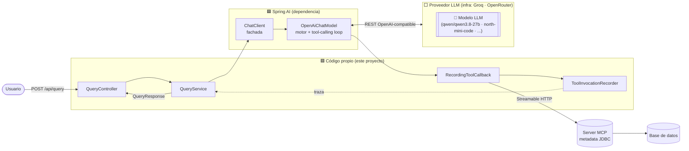
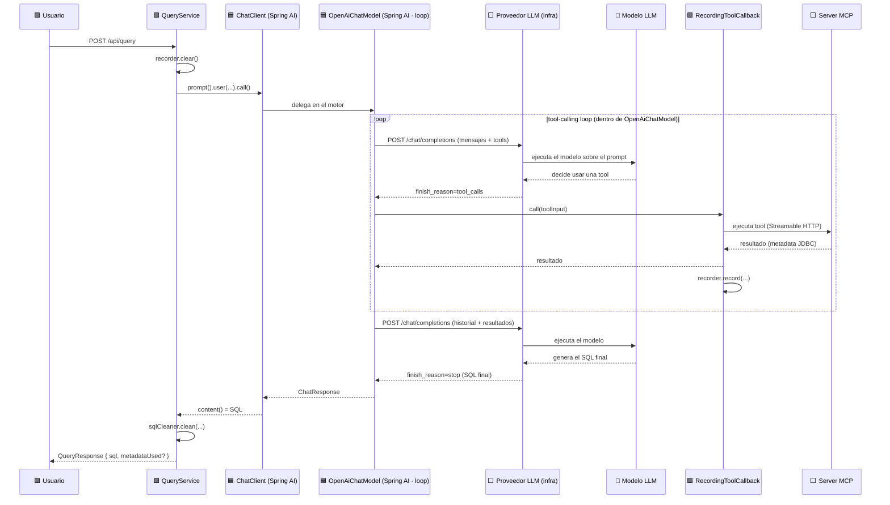
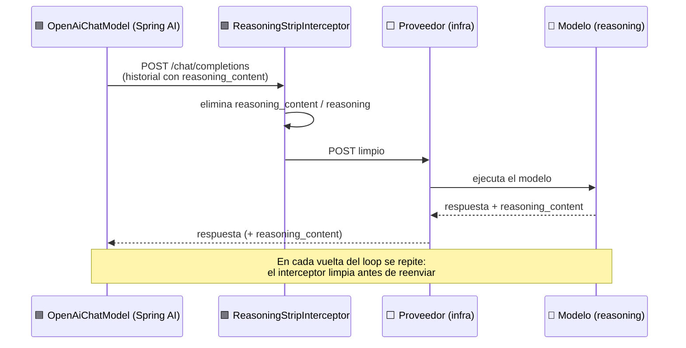
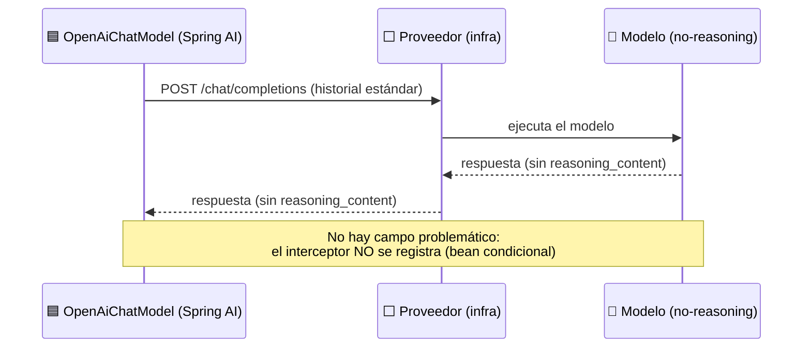
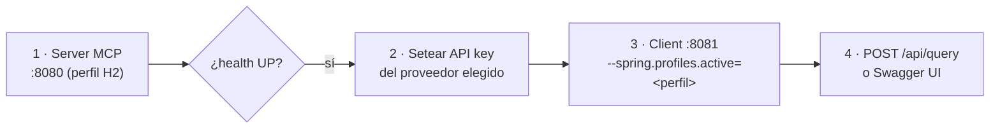
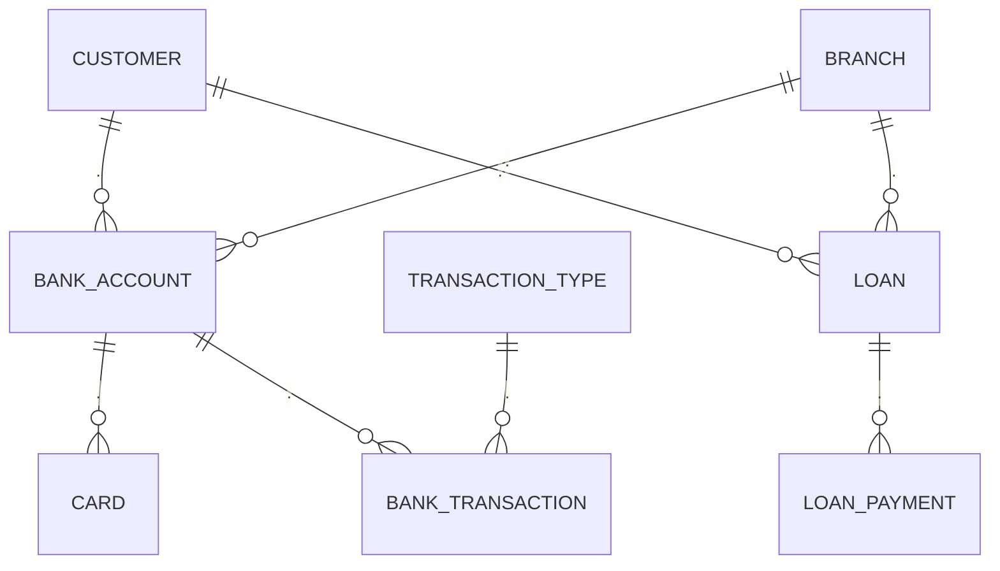

# Capsula MCP · Client (NL→SQL)

Cliente Spring Boot que traduce **lenguaje natural a SQL** usando un LLM que, mediante
**tools MCP**, inspecciona el esquema real de una base de datos antes de construir la query.

El cliente no conoce el esquema de antemano: delega en un **server MCP** (metadata JDBC)
las consultas de tablas, columnas, foreign keys, índices, etc. El LLM decide qué tools
llamar y en qué orden mediante un **tool-calling loop** gestionado por Spring AI.

---

## Tabla de contenidos

- [Características](#características)
- [Stack](#stack)
- [Arquitectura](#arquitectura)
- [Cómo funciona el tool-calling](#cómo-funciona-el-tool-calling)
- [Modelos: con razonamiento vs sin razonamiento](#modelos-con-razonamiento-vs-sin-razonamiento)
- [Glosario de componentes](#glosario-de-componentes)
- [Requisitos](#requisitos)
- [Configuración](#configuración)
- [Puesta en marcha](#puesta-en-marcha)
- [Ejecución](#ejecución)
- [API](#api)
- [Base de datos de ejemplo](#base-de-datos-de-ejemplo)
- [Swagger / OpenAPI](#swagger--openapi)
- [Observabilidad](#observabilidad)
- [Estructura del proyecto](#estructura-del-proyecto)

---

## Características

- 🗣️ **NL→SQL**: convierte un pedido en lenguaje natural en una sentencia SQL válida.
- 🔌 **Tools MCP**: el LLM inspecciona el esquema real vía un server MCP (transporte Streamable HTTP).
- 🔁 **Tool-calling loop automático**: gestionado por Spring AI; el LLM encadena varias
  tools antes de responder.
- 🔀 **Multi-proveedor**: Groq y OpenRouter (todos OpenAI-compatible) por perfil,
  sin tocar código.
- 🧠 **Soporte de modelos de razonamiento**: interceptor que limpia `reasoning_content`
  para providers que lo rechazan en el multi-turno.
- 🧾 **Traza de tools**: opcionalmente devuelve qué tools MCP usó el LLM (`includeMetadata`).
- 📊 **Observabilidad**: logs técnicos de cada llamada al LLM y a cada tool (Micrometer).
- 📖 **Swagger UI**: documentación OpenAPI interactiva.

---

## Stack

| Componente | Versión |
|------------|---------|
| Java | 21 |
| Spring Boot | 4.1.1 |
| Spring AI | 2.0.1 |
| springdoc-openapi | 3.1.1 |
| Puerto del cliente | 8081 |
| Puerto del server MCP | 8080 |

---

## Arquitectura

Los diagramas distinguen tres capas:
🟩 **código propio** de este proyecto · 🟦 **componentes internos de Spring AI**
(vienen en las dependencias, no los escribís vos) · ⬜ **servicios externos**.
Además, 🤖 marca el **modelo LLM** que corre dentro del proveedor (no es lo mismo el
proveedor —la infra— que el modelo —el LLM—; ver el [glosario](#glosario-de-componentes)).



Hay **dos canales de red** distintos:

1. **Cliente ↔ Proveedor LLM**: REST (protocolo OpenAI), donde ocurre el tool-calling loop.
2. **Cliente ↔ Server MCP**: Streamable HTTP (`http://localhost:8080/mcp`), donde se ejecutan las tools.

> **Proveedor ≠ Modelo.** El **proveedor** (Groq, OpenRouter) es la
> **infraestructura** que expone la API REST; el **modelo** (p. ej. `qwen/qwen3.8-27b`) es el
> **LLM** que corre sobre esa infra y que realmente razona y decide las tools. Un mismo
> proveedor puede servir varios modelos, y un mismo modelo (como `qwen/qwen3.8-27b`) puede
> estar disponible en varios proveedores. Por eso en la config elegís **ambos**: la
> `base-url` (proveedor) y el `model` (modelo).

> **¿Qué es `OpenAiChatModel`?** Es una clase **interna de Spring AI** (del starter
> `spring-ai-starter-model-openai`), no de este proyecto. Es el **motor** detrás del
> `ChatClient`: arma el `POST` REST al proveedor y **ejecuta el tool-calling loop**. Se
> llama "OpenAi" por el **protocolo** (OpenAI-compatible), no por la empresa: la misma
> clase sirve para Groq y OpenRouter. Ver el [glosario](#glosario-de-componentes).

---

## Cómo funciona el tool-calling

Un único `.call()` del `ChatClient` puede disparar **varios round-trips REST** al proveedor:
el LLM pide una tool, el cliente la ejecuta localmente (vía MCP) y le devuelve el resultado,
y así hasta que el LLM produce el SQL final.



> 🟦 `ChatClient` y `OpenAiChatModel` son de **Spring AI** (no de este proyecto). El
> `ChatClient` es la fachada que usás en `QueryService`; `OpenAiChatModel` es el motor
> interno que corre el loop. El bucle **completo** ocurre dentro de un único `.call()`.
>
> ⬜ **Proveedor** vs 🤖 **Modelo**: el proveedor es la infra que recibe el POST; el modelo
> es el LLM que efectivamente razona, decide las tools y genera el SQL. Separarlos deja claro
> que "quién piensa" es el **modelo**, no el proveedor.

**Puntos de enganche propios** alrededor del loop del framework:

- `RecordingToolCallback` — decora cada tool MCP para registrar la invocación.
- `ToolInvocationRecorder` — acumula la traza por request (request-scoped).
- `ReasoningStripInterceptor` — limpia el body antes de cada POST (ver abajo).

---

## Modelos: con razonamiento vs sin razonamiento

Algunos modelos (p. ej. `qwen/qwen3.8-27b` en Groq) son de **razonamiento**: devuelven
un campo `reasoning_content` que es de **solo salida**. El provider lo emite en la respuesta
pero lo **rechaza** (HTTP 400) si se lo reenvían en la request del siguiente turno.

En un tool-calling loop, Spring AI reenvía el historial completo en cada turno, incluido ese
campo. La solución es el `ReasoningStripInterceptor` (OkHttp), activado por
`capsula.model.strip-reasoning=true`, que **remueve `reasoning_content`/`reasoning`** del
body antes de cada POST a `/chat/completions`.

### Modelo CON razonamiento (Groq · `strip-reasoning=true`)



Sin el interceptor, el segundo turno del loop fallaría con
`400: property 'reasoning_content' is unsupported`.

> 🟦 `OpenAiChatModel` (Spring AI) genera el POST; 🟩 `ReasoningStripInterceptor` es
> código **propio** (un interceptor OkHttp) que se cuela justo antes de que la request salga.
> 🤖 El `reasoning_content` lo produce el **modelo** (no el proveedor): es parte de cómo
> "piensa" un modelo de razonamiento.

### Modelo SIN razonamiento (OpenRouter · `strip-reasoning=false`)



El bean `ReasoningContentStripConfig` es `@ConditionalOnProperty`: si
`strip-reasoning=false`, **no se crea** y no hay overhead.

| Perfil | Proveedor | Modelo | Razonamiento | `strip-reasoning` |
|--------|-----------|--------|--------------|-------------------|
| `groq` | Groq | `qwen/qwen3.8-27b` | Sí | `true` |
| `openrouter` (default) | OpenRouter | `cohere/north-mini-code:free` | No | `false` |

---

## Glosario de componentes

Referencia rápida de quién es quién en los diagramas. La columna **Origen** aclara si es
código de este repo o algo que trae Spring AI por dependencia.

| Componente | Origen | Qué hace |
|------------|--------|----------|
| `QueryController` | 🟩 Propio | Expone `POST /api/query`. |
| `QueryService` | 🟩 Propio | Orquesta NL→SQL: llama al `ChatClient`, limpia el SQL y adjunta la traza. |
| `RecordingToolCallback` | 🟩 Propio | Decorator que envuelve cada tool MCP para registrar la invocación. |
| `ToolInvocationRecorder` | 🟩 Propio | Acumula la traza de tools por request (request-scoped). |
| `ReasoningStripInterceptor` | 🟩 Propio | Interceptor OkHttp que quita `reasoning_content` antes de cada POST. |
| `SqlResponseCleaner` | 🟩 Propio | Quita fences markdown del SQL devuelto. |
| **`ChatClient`** | 🟦 Spring AI | **Fachada** de alto nivel (`prompt().user().call()`). Agnóstica del proveedor. Es lo que usás en `QueryService`. |
| **`OpenAiChatModel`** | 🟦 Spring AI | **Motor** detrás del `ChatClient`. Arma el `POST` REST al proveedor y **ejecuta el tool-calling loop**. Se llama "OpenAi" por el **protocolo** (OpenAI-compatible), no por la empresa: sirve para Groq y OpenRouter. |
| `ToolCallback` (MCP) | 🟦 Spring AI | Representación de una tool MCP que el `ChatModel` puede invocar. `RecordingToolCallback` lo decora. |
| Proveedor LLM | ⬜ Externo | **Infraestructura** que expone la API OpenAI-compatible: Groq / OpenRouter. Recibe el POST y ejecuta el modelo. No "piensa" él mismo. |
| Modelo LLM | 🤖 Externo | El **LLM** que corre en la infra del proveedor (`qwen/qwen3.8-27b`, `north-mini-code`, …). Es quien realmente razona, decide las tools y genera el SQL. Se elige con `spring.ai.openai.chat.options.model`. |
| Server MCP | ⬜ Externo | Servicio de metadata JDBC; se consulta por SSE en `:8080`. |

> **Idea clave**: tu código habla con la **fachada** `ChatClient`. Toda la maquinaria de
> hablar REST con el proveedor y de repetir el loop de tools vive en `OpenAiChatModel`, que
> **viene con Spring AI** — por eso no lo encontrás en este repositorio.
>
> **Proveedor ≠ Modelo**: el **proveedor** es la infra (la `base-url`); el **modelo** es el
> LLM que corre ahí (el `model`). Quien razona y decide las tools es siempre el
> **modelo**.

---

## Requisitos

- **JDK 21**
- **Server MCP** de metadata corriendo en `http://localhost:8080` (con endpoint `/mcp`).
- **API key** del proveedor elegido, en variable de entorno:
  - `GROQ_API_KEY` u `OPENROUTER_API_KEY`.

---

## Configuración

La configuración base vive en `application.properties`; la de cada proveedor en un archivo
por perfil (`application-<perfil>.properties`). Se alterna con `spring.profiles.active`.

```ini
# application.properties (extracto)
server.port=8081
spring.profiles.active=openrouter            # groq | openrouter

spring.ai.mcp.client.streamable-http.connections.server.url=http://localhost:8080
spring.ai.mcp.client.streamable-http.connections.server.endpoint=/mcp
spring.ai.mcp.client.request-timeout=60s     # el loop encadena varias tool-calls
```

Setear la API key (PowerShell):

```powershell
$env:OPENROUTER_API_KEY = "sk-..."
```

---

## Puesta en marcha

Guía completa para levantar **todo el sistema** de cero. Son **dos procesos** que deben
estar corriendo a la vez: el **server MCP** (puerto 8080) y el **client** (puerto 8081).

### Paso 1 · Levantar el server MCP (puerto 8080)

El client **no arranca con sus tools** si el server MCP no está disponible: en el arranque,
el `spring-ai-starter-mcp-client` se conecta por Streamable HTTP a `http://localhost:8080/mcp` para
descubrir las tools. **Siempre levantá el server primero.**

```powershell
# En el proyecto server (perfil H2 por default, con el esquema bancario de demo)
cd "..\server"
.\mvnw.cmd -DskipTests spring-boot:run
```

Verificá que esté arriba antes de seguir:

```powershell
curl http://localhost:8080/actuator/health   # debe responder {"status":"UP"}
```

### Paso 2 · Elegir proveedor y setear su API key

El client usa **un perfil por proveedor**. Cada perfil necesita su propia variable de
entorno con la API key. Seteá **solo la del proveedor que vayas a usar**:

| Perfil | Variable de entorno | Obtener la key |
|--------|---------------------|----------------|
| `openrouter` (default) | `OPENROUTER_API_KEY` | https://openrouter.ai/keys |
| `groq` | `GROQ_API_KEY` | https://console.groq.com/keys |

```powershell
# Ejemplo para el perfil por default (openrouter)
$env:OPENROUTER_API_KEY = "sk-or-..."
```

### Paso 3 · Levantar el client (puerto 8081) con el perfil elegido

El perfil se selecciona con `spring.profiles.active`. Si no se especifica, usa el default
del `application.properties` (`openrouter`).

```powershell
# En el proyecto client (otra terminal, con el server ya arriba)

# Opción A — perfil por default (openrouter · modelo SIN razonamiento)
.\mvnw.cmd spring-boot:run

# Opción B — Groq (modelo CON razonamiento · qwen/qwen3.8-27b)
.\mvnw.cmd spring-boot:run "-Dspring-boot.run.arguments=--spring.profiles.active=groq"

```

> Alternativa: también podés fijar el perfil con la variable de entorno
> `$env:SPRING_PROFILES_ACTIVE="groq"` antes de `spring-boot:run`.

### Paso 4 · Probar el flujo completo

```powershell
curl -Method POST http://localhost:8081/api/query `
  -ContentType 'application/json' `
  -Body '{ "request": "clientes con al menos una tarjeta", "includeMetadata": true }'
```

O desde **Swagger UI**: http://localhost:8081/swagger-ui.html

### Resumen visual del orden de arranque



### Checklist de troubleshooting

| Síntoma | Causa probable | Solución |
|---------|----------------|----------|
| El client arranca pero no usa tools | Server MCP caído al iniciar el client | Levantá el server **primero** y reiniciá el client |
| `401 Unauthorized` del proveedor | API key faltante o inválida | Verificá la variable de entorno del perfil activo |
| `400 property 'reasoning_content' is unsupported` | Perfil reasoning sin el interceptor | Usá un perfil con `strip-reasoning=true` (groq) |
| Timeout en `/api/query` | El loop encadenó muchas tools | Subí `spring.ai.mcp.client.request-timeout` |
| Puerto 8080/8081 ocupado | Otro proceso usa el puerto | Liberá el puerto o cambiá `server.port` |

---

## Ejecución

> Para levantar el sistema completo paso a paso, ver [Puesta en marcha](#puesta-en-marcha).
> Esta sección cubre comandos de **build/empaquetado**.

```powershell
# Compilar y correr tests
.\mvnw.cmd clean verify

# Empaquetar el JAR ejecutable
.\mvnw.cmd clean package
java -jar target\client-0.0.1-SNAPSHOT.jar --spring.profiles.active=groq
```

---

## API

### `POST /api/query`

**Request**

```json
{
  "request": "traeme los clientes con al menos una tarjeta",
  "includeMetadata": false
}
```

| Campo | Tipo | Requerido | Descripción |
|-------|------|-----------|-------------|
| `request` | string | ✅ | Pedido en lenguaje natural. |
| `includeMetadata` | boolean | ❌ (default `false`) | Si `true`, incluye la traza de tools MCP. |

**Response** (`includeMetadata=false`)

```json
{
  "sql": "SELECT c.first_name, c.last_name FROM customer c JOIN card cd ON cd.bank_account_id IN (SELECT id FROM bank_account WHERE customer_id = c.id)"
}
```

**Response** (`includeMetadata=true`) — incluye `metadataUsed` con la traza de tools.

**Ejemplo cURL**

```bash
curl -X POST http://localhost:8081/api/query \
  -H "Content-Type: application/json" \
  -d '{"request":"clientes con al menos una tarjeta","includeMetadata":true}'
```

---

## Base de datos de ejemplo

Con el perfil **H2** (default del server), se carga automáticamente un **esquema bancario**
de demo en el schema `PRUEBA_MCP` (desde `schema.sql` + `data.sql` del server). Es el
esquema que el LLM inspecciona vía tools MCP para construir el SQL.



| Tabla | Descripción | FKs principales |
|-------|-------------|-----------------|
| `CUSTOMER` | Clientes del banco | — |
| `BRANCH` | Sucursales | — |
| `BANK_ACCOUNT` | Cuentas bancarias | → `CUSTOMER`, `BRANCH` |
| `CARD` | Tarjetas asociadas a una cuenta | → `BANK_ACCOUNT` |
| `TRANSACTION_TYPE` | Tipos de movimiento (depósito, extracción, transferencia) | — |
| `BANK_TRANSACTION` | Movimientos de una cuenta | → `BANK_ACCOUNT`, `TRANSACTION_TYPE` |
| `LOAN` | Préstamos | → `CUSTOMER`, `BRANCH` |
| `LOAN_PAYMENT` | Pagos de un préstamo | → `LOAN` |

**Ejemplos de pedidos en lenguaje natural:**

- "clientes con al menos una tarjeta"
- "saldo total por sucursal"
- "últimas transacciones de la cuenta 00010001"
- "préstamos aprobados y su monto por cliente"
- "cuentas sin movimientos registrados"

> El esquema completo (tipos, UNIQUEs, índices) y su documentación están en el
> **`server/README.md`**.

---

## Swagger / OpenAPI

- **Swagger UI**: http://localhost:8081/swagger-ui.html
- **OpenAPI JSON**: http://localhost:8081/v3/api-docs

> Se usa **springdoc 3.x**, la línea compatible con Spring Boot 4 (la 2.8.x es para
> Spring Boot 3).

---

## Observabilidad

`ObservabilityConfig` registra un handler de Micrometer que loguea, de forma legible, solo
las observaciones relevantes de Spring AI:

```
[IA] LLM   modelo=qwen/qwen3.8-27b · 812 ms
[IA] TOOL  db_list_tables · 41 ms
[IA] TOOL  db_get_table_snapshot · 55 ms
```

Endpoints de Actuator expuestos: `health`, `info`, `metrics`.

---

## Estructura del proyecto

```
src/main/java/com/capsula/mcp/client/
├── ClientApplication.java            # main Spring Boot
├── config/
│   ├── ChatClientConfig.java         # arma el ChatClient + envuelve tools MCP
│   ├── ObservabilityConfig.java      # logs técnicos de LLM y tools (Micrometer)
│   ├── OpenApiConfig.java            # metadata Swagger/OpenAPI
│   └── ReasoningContentStripConfig.java  # interceptor reasoning_content (condicional)
├── controller/
│   └── QueryController.java          # POST /api/query
├── dto/
│   ├── QueryRequest.java
│   ├── QueryResponse.java
│   └── ToolInvocation.java
├── service/
│   ├── QueryService.java             # orquesta NL→SQL + traza
│   └── SqlResponseCleaner.java       # limpia fences markdown del SQL
└── tool/
    ├── RecordingToolCallback.java    # decorator que registra cada tool MCP
    └── ToolInvocationRecorder.java   # acumula la traza por request

src/main/resources/
├── application.properties            # base (perfil activo, MCP, swagger)
├── application-groq.properties       # Groq · reasoning
└── application-openrouter.properties # OpenRouter · no-reasoning
```