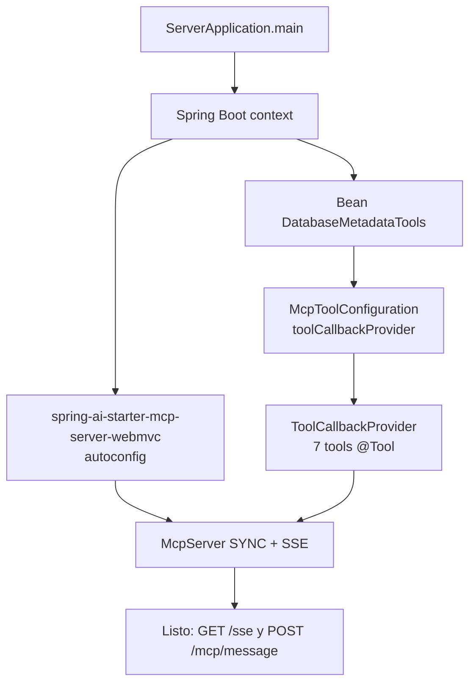
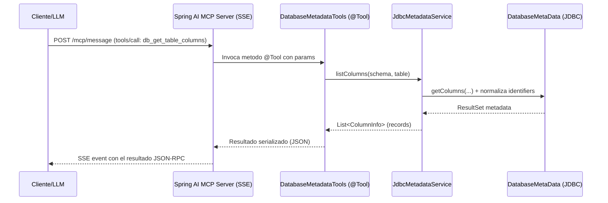

# Database Metadata MCP Server

Servidor MCP (Spring Boot + Spring AI) que expone metadata JDBC de una unica base relacional configurada por properties. Cambiar de motor implica solo cambiar la dependencia JDBC y el bloque `spring.datasource.*`.

## Indice

- [Stack y dependencia MCP](#stack-y-dependencia-mcp)
- [Arquitectura y estructura](#arquitectura-y-estructura)
- [Flujo de arranque (registro de tools)](#flujo-de-arranque-registro-de-tools)
- [Flujo de una invocacion de tool](#flujo-de-una-invocacion-de-tool)
- [Puesta en marcha](#puesta-en-marcha)
  - [Prerrequisitos](#prerrequisitos)
  - [1. Levantar con el perfil H2](#1-levantar-con-el-perfil-h2-datos-demo-sin-dependencias-externas)
  - [2. Levantar con otro motor](#2-levantar-con-otro-motor-ejemplo-postgresql)
  - [3. Verificar que esta arriba](#3-verificar-que-esta-arriba)
  - [4. Conectar un cliente MCP](#4-conectar-un-cliente-mcp)
- [Motor por dependencia y perfil](#motor-por-dependencia-y-perfil)
- [Tools MCP disponibles](#tools-mcp-disponibles)
- [Properties de metadata](#properties-de-metadata)
- [Ejecucion local (H2 + datos demo)](#ejecucion-local-h2--datos-demo)
- [Tests](#tests)
- [Requisitos](#requisitos)
- [Notas de diseno](#notas-de-diseno)

## Stack y dependencia MCP

- **Spring Boot 4** (web MVC, JDBC, actuator, validation).
- **Spring AI `2.0.1`**, via el starter `spring-ai-starter-mcp-server-webmvc`.
  - Autoconfigura el servidor MCP sobre HTTP usando **SSE** (Server-Sent Events).
  - El servidor corre en modo **SYNC** (`spring.ai.mcp.server.type=SYNC`).
  - Endpoints por default: `GET /sse` (stream) y `POST /mcp/message` (mensajes JSON-RPC).
- **JDBC puro** sobre `DatabaseMetaData`: sin SQL vendor-specific, agnostico de motor.

El starter escanea beans que exponen metodos anotados con `@Tool` y los publica como
tools MCP. En este proyecto el registro se centraliza en `McpToolConfiguration`, que
construye un unico `ToolCallbackProvider` a partir de `DatabaseMetadataTools`.

## Arquitectura y estructura

El codigo se organiza por capas dentro de `com.capsula.mcp.server`:

```
com.capsula.mcp.server
├── ServerApplication            # Entry point Spring Boot
├── mcp/
│   └── McpToolConfiguration     # Registra las @Tool como ToolCallbackProvider (MCP)
└── metadata/
    ├── tool/
    │   └── DatabaseMetadataTools# Capa MCP: metodos @Tool expuestos al LLM
    ├── service/
    │   ├── MetadataService      # Contrato de acceso a metadata
    │   ├── JdbcMetadataService  # Implementacion sobre DatabaseMetaData
    │   └── IdentifierNormalizer # Normaliza case de identifiers por motor
    ├── model/                   # Records: TableInfo, ColumnInfo, ForeignKeyInfo,
    │   └── ...                  #   IndexInfo, ConstraintInfo, PrimaryKeyInfo,
    │                            #   SchemaInfo, TableSnapshot
    ├── config/
    │   └── MetadataProperties   # Guardrails (max-results, excluded-schemas)
    └── exception/
        └── MetadataAccessException  # Envuelve SQLException con SQLState

```

Separacion de responsabilidades:

- **tool** → contrato hacia el LLM (nombres, descripciones, params `@ToolParam`).
- **service** → logica JDBC reutilizable.
- **model** → DTOs inmutables (records) serializados en la respuesta MCP.
- **config/exception** → guardrails y manejo de errores homogeneo.

## Flujo de arranque (registro de tools)

Al iniciar, el starter de Spring AI descubre las tools y levanta el endpoint SSE:



## Flujo de una invocacion de tool

Un cliente MCP (o un LLM a traves de el) llama una tool y la respuesta viaja por SSE:



## Puesta en marcha

### Prerrequisitos

- **JDK 21+** activo (`java -version` debe reportar 21 o superior).
- No hace falta instalar Maven: se usa el **wrapper** incluido (`mvnw.cmd` / `mvnw`).
- Puerto **8080** libre (default de Spring Boot; no hay override configurado).
- Para H2 no necesitas nada mas (base en memoria). Para otros motores, una instancia
  accesible y su bloque `spring.datasource.*` en el `application-<motor>.properties`.

### 1. Levantar con el perfil H2 (datos demo, sin dependencias externas)

```powershell
.\mvnw.cmd -DskipTests spring-boot:run
```

El perfil `h2` ya es el default (`spring.profiles.active=h2`), por lo que no hace falta
setear nada mas. Al arrancar se ejecutan `schema.sql` y `data.sql` con el esquema bancario.

### 2. Levantar con otro motor (ejemplo PostgreSQL)

```powershell
$env:SPRING_PROFILES_ACTIVE="postgres"
.\mvnw.cmd spring-boot:run
```

Asegurate de tener la dependencia JDBC del motor en el `pom.xml` y el bloque
`spring.datasource.*` completo en `application-postgres.properties`. Los drivers de
PostgreSQL, MySQL y Oracle ya estan **incluidos y comentados** en el `pom.xml`: solo
hay que descomentar el del motor elegido (no hace falta agregarlos a mano).

### 3. Verificar que esta arriba

```powershell
# Health check de actuator
curl http://localhost:8080/actuator/health

# Endpoint SSE del servidor MCP (queda abierto escuchando eventos)
curl http://localhost:8080/sse

```

### 4. Conectar un cliente MCP

Apunta tu cliente MCP (por ejemplo un host compatible) al transporte SSE:

```jsonc
{
  "url": "http://localhost:8080/sse",
  "transport": "sse"
}
```

Una vez conectado, el cliente descubre las 7 tools (`db_list_schemas`, `db_list_tables`,
`db_get_table_columns`, `db_get_foreign_keys`, `db_get_indexes`, `db_get_constraints`,
`db_get_table_snapshot`).

## Motor por dependencia y perfil

| Motor      | Dependencia Maven                                | Perfil / properties activo                |
|------------|--------------------------------------------------|-------------------------------------------|
| H2         | `com.h2database:h2`                              | `application-h2.properties` (default)     |
| PostgreSQL | `org.postgresql:postgresql`                      | `application-postgres.properties`         |
| MySQL      | `com.mysql:mysql-connector-j`                    | `application-mysql.properties`            |
| Oracle     | `com.oracle.database.jdbc:ojdbc11`               | `application-oracle.properties`           |

> Los drivers de PostgreSQL, MySQL y Oracle estan **pre-declarados y comentados** en el
> `pom.xml`. Para cambiar de motor: descomentar el `<dependency>` correspondiente y
> activar su perfil. Postgres y MySQL toman la version del BOM de Spring Boot; Oracle
> lleva version explicita (`ojdbc11`) por no estar gestionado en el BOM.

Activar perfil:

```powershell
$env:SPRING_PROFILES_ACTIVE="postgres"
.\mvnw.cmd spring-boot:run
```

## Tools MCP disponibles

| Tool                      | Descripcion                                                                 |
|---------------------------|-----------------------------------------------------------------------------|
| `db_list_schemas`         | Lista schemas visibles (oculta system por default).                         |
| `db_list_tables`          | Lista tablas/vistas de un schema con patron LIKE y limite.                  |
| `db_get_table_columns`    | Columnas de una tabla con tipo, nullability, default, size, scale, orden.   |
| `db_get_foreign_keys`     | FKs de la tabla (imported=salientes, exported=entrantes).                   |
| `db_get_indexes`          | Indices con nombre, unicidad, tipo y columnas ordenadas.                    |
| `db_get_constraints`      | PK + UNIQUE + FOREIGN_KEY de la tabla (CHECK se omite por soporte JDBC).    |
| `db_get_table_snapshot`   | Vista agregada: metadata + columnas + PK + FKs + indices en 1 call.         |

> Las tools se registran en `McpToolConfiguration`. Para **desactivar** una tool sin
> borrarla (por ejemplo `db_get_table_snapshot`, y asi forzar al LLM a orquestar las
> tools atomicas) basta con filtrar su nombre al construir el `ToolCallbackProvider`.

## Properties de metadata

Definidas en `MetadataProperties`:

```properties
# Cap maximo por respuesta para evitar explotar el contexto del LLM.
mcp.metadata.max-results=200

# Schemas ocultos por default (comparacion case-insensitive).
mcp.metadata.excluded-schemas=INFORMATION_SCHEMA,SYS,SYSTEM,PG_CATALOG,MYSQL,PERFORMANCE_SCHEMA
```

## Ejecucion local (H2 + datos demo)

```powershell
.\mvnw.cmd -DskipTests spring-boot:run
```

- Datos demo (perfil H2): esquema bancario con las tablas `CUSTOMER`, `BRANCH`,
  `BANK_ACCOUNT`, `CARD`, `TRANSACTION_TYPE`, `BANK_TRANSACTION`, `LOAN` y
  `LOAN_PAYMENT`, cargadas desde `schema.sql` y `data.sql`.

### Consola H2

Disponible solo con el perfil `h2` (base en memoria). Entra a
`http://localhost:8080/h2-console` y completa exactamente estos datos:

| Campo         | Valor                                                                          |
|---------------|--------------------------------------------------------------------------------|
| **JDBC URL**  | `jdbc:h2:mem:mcpdb` (si no ves las tablas, usa la URL completa de abajo)        |
| **User Name** | `sa`                                                                           |
| **Password**  | *(vacio)*                                                                      |
| **Driver**    | `org.h2.Driver` (preseleccionado)                                              |

URL completa equivalente a la del perfil (`application-h2.properties`):

```
jdbc:h2:mem:mcpdb;MODE=PostgreSQL;DB_CLOSE_DELAY=-1;DB_CLOSE_ON_EXIT=FALSE
```

- Las tablas del demo viven bajo el schema **`PRUEBA_MCP`** (el `schema.sql` hace
  `SET SCHEMA PRUEBA_MCP`). Si el arbol de objetos aparece vacio, expandi ese schema
  o ejecuta `SET SCHEMA PRUEBA_MCP;` en la consola.
- Al ser **en memoria**, los datos solo existen mientras la app esta corriendo.
- La consola requiere el modulo `spring-boot-h2console` en el `pom.xml`. En Spring Boot 4
  su autoconfig se modularizo fuera de `spring-boot-autoconfigure`, por lo que esa
  dependencia debe estar declarada (ya incluida en este proyecto); sin ella,
  `spring.h2.console.enabled=true` no tiene efecto.

## Tests

```powershell
.\mvnw.cmd test
```

## Requisitos

- JDK 21 activo (`java -version` debe reportar 21+).
- Maven 

## Notas de diseno

- Transporte MCP sobre **SSE** (`spring-ai-starter-mcp-server-webmvc`), server **SYNC**;
  configurable en `application.properties` (`spring.ai.mcp.server.*`).
- Todas las tools son read-only sobre `DatabaseMetaData`, sin SQL vendor-specific.
- Identifiers se normalizan al case natural del motor (upper en H2/Oracle, lower en Postgres).
- Errores JDBC se envuelven en `MetadataAccessException` con SQLState para diagnostico.